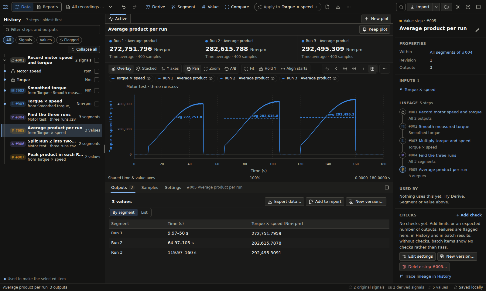
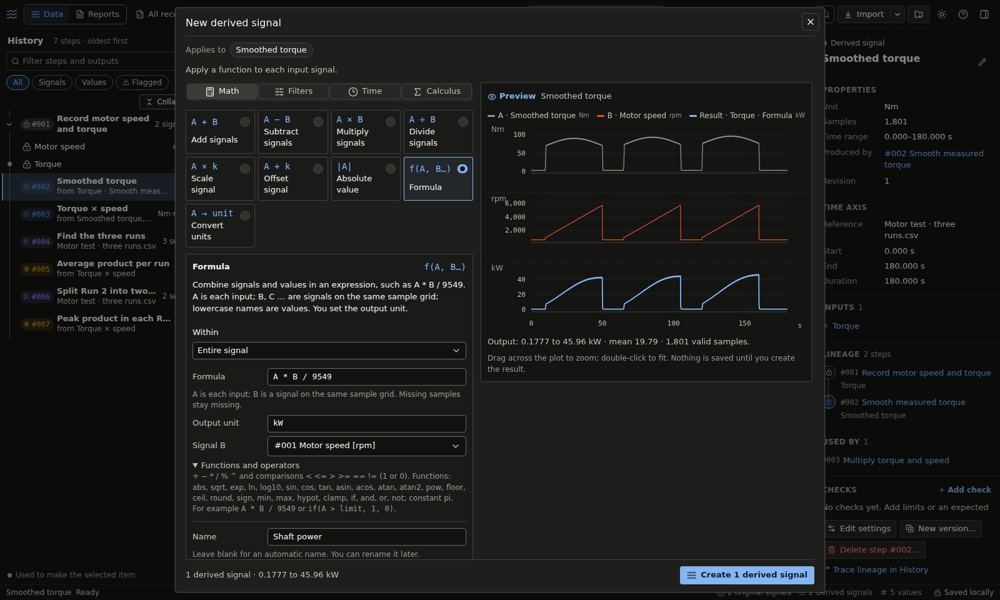
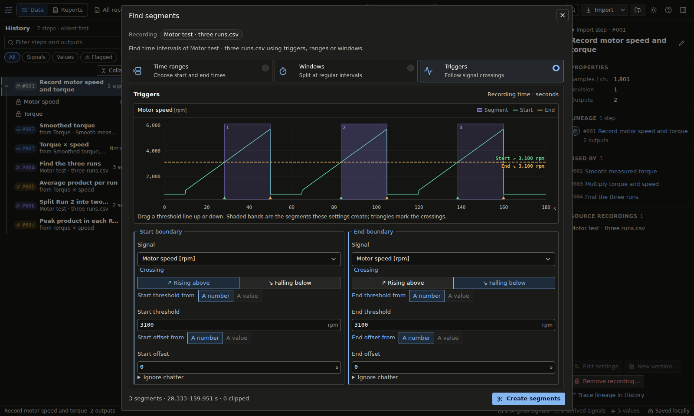
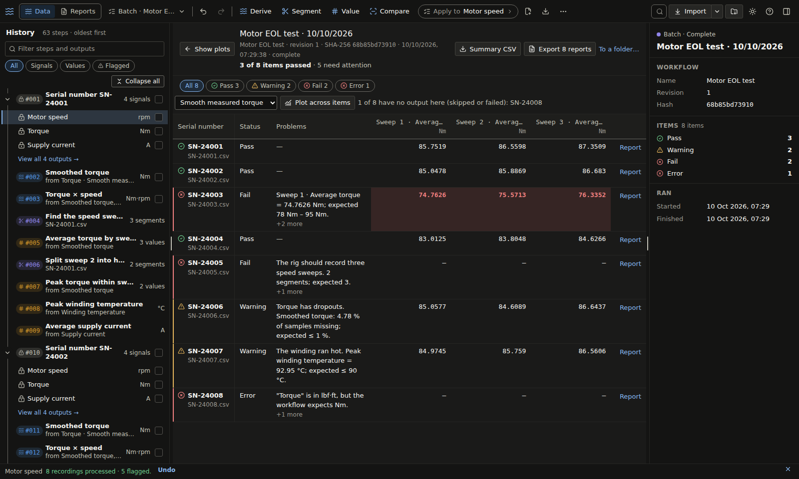
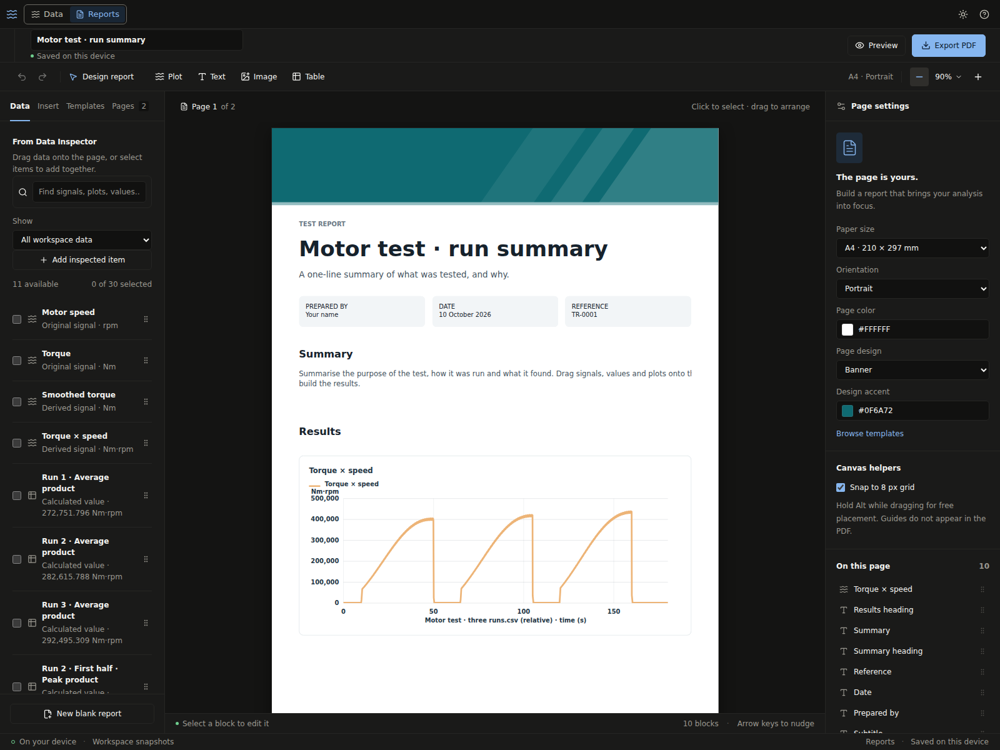

<div align="center">


# Stratum

**A desktop workbench for test recordings.**
Open a recording, derive signals, cut it into segments and measure values, and
every result keeps a traceable link back to the original samples.

[](https://github.com/Kyleidge/Stratum/actions/workflows/ci.yml)
[](https://github.com/Kyleidge/Stratum/releases)
[](https://github.com/Kyleidge/Stratum/releases)
[](LICENSE)

[Download](#download) · [Features](#features) · [Beginner's guide](docs/beginners-guide.md) · [User guide](docs/user-guide.md) · [Build from source](#build-from-source)

</div>

<picture>
  <source media="(prefers-color-scheme: light)" srcset="docs/images/readme/workspace-light.png">
  
</picture>

## Why Stratum?

Test-bench and logger data usually ends up in one-off spreadsheets and scripts:
hard to repeat, harder to audit. Stratum keeps the whole analysis as a
**chronological history of steps**. Each step records exactly which inputs it
used and which outputs it produced, so any number on a report can be traced
back through every filter, segment and calculation to the recording it came
from.

- **Original samples never change.** Every step creates new signals or values.
- **Edit any step** and everything that depends on it recalculates in one
  change, with a preview of what will be affected. Undo and Redo survive
  restarts.
- **Your data stays on your computer.** No accounts, no uploads, no server.
- **Built for long, high-rate recordings.** Files are streamed in pieces, plots
  use persistent min/max indexes, and processing runs off the UI thread.

## Features

### Derive signals, with a live preview

Math between signals, scaling and offsets, unit conversion, moving-average,
median, exponential, RC and Butterworth filters, derivatives, integrals,
resampling and time shifts. **Formula** evaluates expressions such as
`A * B / 9549` across signals and calculated values. Expressions are parsed,
never run as code. Every dialog previews its result before anything is
created.



### Find segments

Split a recording into the parts that matter, such as each test run, using
time ranges, regular windows or **signal triggers** with signed offsets,
hysteresis and debounce to ignore chatter. Segments are time intervals of the
whole recording, so you can derive signals, calculate values or find nested
segments within all of them or just one.



### Measure values

Averages, minimum and maximum, RMS, standard deviation, peak to peak, area,
durations, time above or below a threshold, crossing times and counts, all
computed exactly in one streaming pass. Values are first-class results: they
plot as labelled reference lines, combine in formulas and can drive other
settings, such as offsetting each run by its own average.

### Run the same workflow on many recordings

Save a recording's steps, checks and report layout as a readable
`.stratum.yaml` workflow, then run it on a folder of files: one per component
from an end-of-line rig, for example. Stratum flags items that fail their
limits, explains why, and exports a PDF report per item. One Undo removes the
whole batch.



### Compose reports

A page-based **Reports** workspace sits beside the data. Drop in plots, value
tables, text and images, choose a page design, and export a PDF on your
device. Captures are snapshots: they change only when you choose to update
them.



### And more

- **Recording formats:** CSV and other delimited text (semicolons with decimal
  commas, tabs, UTF-16, Windows-1252), **MDF 3 and 4**, **NI TDMS**, **MATLAB
  `.mat`**, **Excel `.xlsx`** and **WAV**. See [file formats](docs/file-formats.md).
- **Compare & align** puts recordings from different loggers on one time axis
  by events, offsets or two reference points ([time bases](docs/time-bases.md)).
- **Plots** with a lane per unit, independent Y axes or stacked panels;
  cursors, region statistics from exact samples, annotations and SVG/PNG
  export. Saved plots keep their styles and limits.
- **Exports** of exact samples, values and summaries as CSV, or a standalone
  HTML summary.
- **Workspace backups** (`.stratum`) that are validated in full before they
  restore, plus optional automatic backups on close and every 30 minutes.
- **Ctrl+K** searches every step and output, alongside light and dark themes
  and keyboard access throughout.

## Download

Stratum is a Windows desktop app. Download the installer
(`Stratum-Setup-<version>.exe`) from
[**Releases**](https://github.com/Kyleidge/Stratum/releases). It installs per
user, needs no administrator rights and updates itself.

> [!NOTE]
> Stratum 1.0 is in beta. Each beta is a pre-release on the Releases page;
> **Help → Get Beta Updates** keeps an installed copy on the beta channel. Back
> up your workspace (**Workspace → Save workspace backup…**) before trying a
> new beta. See the [changelog](CHANGELOG.md) for what's in 1.0.

### Try it in two minutes

1. Choose **Explore the example recording** on the welcome screen. A short tour
   walks through a seven-step motor-test analysis built with the same
   operations you'll use on your own data.
2. Choose **Import ▾ → Try the batch example** to run a workflow on eight
   end-of-line recordings and review the flagged items.
3. Import your own file. For CSV, put time in seconds in the first column and
   units in square brackets:

   ```csv
   Time [s],Engine speed [rpm],Torque [Nm]
   0.00,1500,210
   0.01,1502,211
   ```

More sample recordings and exercises are in [examples](examples/README.md).

## Documentation

| Guide                                                                                       | What it covers                                          |
| ------------------------------------------------------------------------------------------- | ------------------------------------------------------- |
| [Beginner's guide](docs/beginners-guide.md) ([PDF](output/pdf/stratum-beginners-guide.pdf)) | An illustrated walk-through from first import to report |
| [User guide](docs/user-guide.md)                                                            | Every part of the workspace, in reference form          |
| [Batch workflows](docs/batch-workflows.md)                                                  | Workflow files, checks, batch runs and per-item reports |
| [File formats](docs/file-formats.md)                                                        | What each recording reader supports                     |
| [Time bases](docs/time-bases.md)                                                            | Aligning recordings from different clocks               |
| [Filters](docs/filters.md)                                                                  | Filter definitions and their responses                  |
| [Architecture and limitations](docs/architecture.md)                                        | Numerical semantics and storage design                  |
| [File format stability](docs/file-format-stability.md)                                      | What each saved format promises across versions         |

## Build from source

You need Node.js 22.15 or later (24 recommended) and pnpm 11.19.0.

```sh
pnpm install --frozen-lockfile
pnpm exec install-electron   # once per computer
pnpm desktop                 # build and launch the desktop app
```

`pnpm dev` serves a browser preview for development; it keeps its own local
storage, separate from the desktop app. `pnpm desktop:package` builds the
Windows installer under `build/releases/` (unsigned unless signing credentials
are set). See [releasing](docs/releasing.md) for the release process.

### Validate

```sh
pnpm test            # numerical, storage, format and workflow tests
pnpm typecheck
pnpm lint
pnpm exec oxfmt --check
pnpm build
pnpm desktop:smokes  # build the desktop app and run every native smoke check
```

CI runs all of these on every push and pull request, with the native smoke
checks on both Linux and Windows. [AGENTS.md](AGENTS.md) describes the
architecture and conventions in detail.

### Built with

React 19 and strict TypeScript, Electron, a Web Worker processing engine with
append-only IndexedDB storage, and Vite. Recording readers are plain
TypeScript; no native plugins.

## License

Stratum is released under the [MIT licence](LICENSE). **Help → Third-party
notices** in the app lists the bundled open-source packages.
