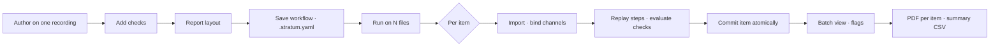

# Batch workflows, checks and per-item reports: plan

Status: implemented on branch `claude/batch-workflow-processing-7b6a8d`. See
[batch workflows](batch-workflows.md) for the user guide and file format. This
page is the original plan, kept for its rationale. The implementation differs
in these ways:

- **YAML parser.** Workflow files use a strict YAML subset parsed by
  `lib/workflow-yaml.ts`, not the `yaml` package. No dependency was added, and
  anchors, aliases and tags are rejected outright. Saving writes a canonical
  layout, so comments in an opened file are not preserved.
- **Check syntax.** Checks are written `count: 3`, `limits: { min, max, unit }`,
  `missing: { max }` or `duration: { min, max }`, not `expect: { … }`.
- **Time origins.** `time-origin: input-start` is supported in version 1 for
  single-input segment steps.
- **Batch items.** Each imported item's step is named `<item label> <ID>`.
  Files that could not be imported are recorded on the batch.
- **Plots.** **Plot across items** labels traces by item through an optional
  per-trace label on saved plots.
- **Not yet done.** Phase 5 follow-ups: re-running a batch with an updated
  workflow, import profiles, items with several files, expression checks and
  vector PDF text.

## Goal

An end-of-line test rig writes one recording per component. An engineer builds
the analysis once, on one recording, with the normal History tools. They add
pass/fail checks, lay out a report and save all of it as a workflow file. They
then run that workflow on any number of recordings. Each recording becomes an
ordinary, inspectable part of History. Unexpected results are flagged while the
batch runs, and every component gets its own PDF report.

The design is generic. An **item** is whatever one recording represents: a
component, a vehicle, a test cycle. The workflow file names it (for example
"Serial number"). The code never mentions rigs or components.

## How it stays part of the current app

1. **A workflow is a recipe of the commands the UI already issues.** Replaying
   it calls the same engine paths as `buildExampleWorkflow` and Edit
   (`applyCommand` with `savedCommand`). There is no second processing engine
   and no separate result store.
2. **Every run produces ordinary History steps, signals and values.** They can
   be plotted, edited, deleted, exported, backed up and undone like work done by
   hand.
3. **There is no third workspace.** Batch review is a view in Data Inspector,
   reached from the existing recording scope menu. Checks are authored in the
   inspector, and report templates in the existing Reports workspace.
4. **Inputs bind by channel name, never by ID.** Outputs are referenced by
   recipe step and position. Batch membership is never inferred from names.
5. **Existing invariants hold:** immutable sources, history and outputs
   committed together, append-only operations, inspection independent of
   processing scope, reports as snapshots, and all data kept on the device.

## Vocabulary

| Term            | Meaning                                                                | Maps to                                        |
| --------------- | ---------------------------------------------------------------------- | ---------------------------------------------- |
| Workflow        | Saved recipe: input channels, steps, checks, optional report template  | `WorkflowRecipe`, a `.stratum.yaml` file       |
| Run             | One application of a workflow to one recording (one item)              | `WorkflowRun`; its steps carry `runId`         |
| Batch           | Runs started together from one workflow revision                       | `WorkflowBatch`                                |
| Check           | An expectation on a step's outputs; a failed check is a **flag**       | `CheckDefinition` on recipe and workflow steps |
| Report template | A report layout whose blocks are bound to recipe outputs, not captured | `report:` section of the workflow file         |

## User journey

1. **Author.** Import `SN-0001.csv`. Smooth, multiply, segment and calculate
   values with the existing tools, exactly as today.
2. **Add checks.** Select the segment step. In the inspector's new **Checks**
   section, choose "Expect 3 outputs". On the values step, set "Each value
   between 250 000 and 300 000". Checks evaluate immediately against this
   recording, so the limits can be tuned on real data, and flags show in History.
3. **Lay out the report.** In Reports, capture the plot and the values table,
   then add a Checks table and the title `Motor EOL report · {{item.id}}`.
4. **Save the workflow.** Choose Workspace → **Save workflow…** and pick the
   recording to save from. The dialog lists the steps derived from it, all
   ticked; unticking a step unticks its dependents. It shows how each input will
   bind (`Torque [Nm]`), lists the checks, and offers to include the current
   report as the template. It also warns about steps that assume fixed timing.
   This writes `Motor EOL.stratum.yaml`.
5. **Run.** Choose Import ▾ → **Run workflow on recordings…**, drop the
   `.stratum.yaml` onto the window, or choose **Run this recording's workflow on
   other files…** from the scope menu, which skips saving. Add 40 CSV files. A
   pre-flight check reads only each header. It shows each file's binding status
   and the item ID parsed from its name. Choose Run.
6. **Watch.** The batch view fills row by row with status, item ID, flags and key
   values. The footer counts flagged items. Processing tools stay disabled, as
   for any long operation, but History and plots can be browsed between items.
   Cancel stops at the next item boundary, and completed items are kept.
7. **Triage.** Filter to Flagged. Opening a row scopes History to that item and
   selects its flagged output. Arrow keys move between items and keep the same
   recipe step selected, so the same plot appears for each item. If a fix is
   justified, use the normal Edit; the run is then marked **edited**.
8. **Deliver.** **Export reports** writes one PDF per item, as a ZIP or into a
   chosen folder, plus a batch summary CSV. One Undo removes the whole batch.



## The workflow file

### Name and format

The `.stratum` extension is already used by the NDJSON workspace backup
(`components/workflow-storage.tsx`, README). Reusing it would make Restore and
Open ambiguous. The proposal is `<name>.stratum.yaml`. It is still recognisably
a Stratum file, opens with YAML highlighting in any editor and diffs cleanly in
Git. The `format: stratum-workflow` header identifies it whatever its name is
(open decision 1).

The file uses the YAML 1.2 core schema only. It is parsed with the `yaml`
package, a new dependency with no transitive dependencies. Its `parseDocument`
keeps comments, so re-saving an opened workflow preserves the user's notes.
Limits:

- 8 MiB per file;
- at most 100 aliases;
- unique keys, and no custom tags;
- at most 500 steps, with bounded nesting depth.

The renderer parses the file for its preview. The worker parses and validates
it again before running anything; it never trusts the renderer's validation.

### Example

This is the built-in motor example, rewritten to segment by triggers so that it
works on recordings with different timing.

```yaml
format: stratum-workflow
version: 1 # File format version
name: Motor EOL test
revision: '3' # The user's own label, printed on reports
description: Three speed sweeps; torque × speed per sweep.
item:
  label: Serial number
  id: { from: file-name, pattern: '^(?<id>SN-\d+)' }

input:
  channels: # Aliases bound by CSV header name; unit checked when given
    speed: { name: Motor speed, unit: rpm }
    torque: { name: Torque, unit: Nm }

steps:
  - id: smoothed
    name: Smooth measured torque
    derive: { function: smooth, input: torque, parameter: 5 }
    outputs: Smoothed torque

  - id: product
    name: Multiply torque and speed
    derive: { function: multiply, input: smoothed, with: speed }
    outputs: Torque × speed

  - id: sweeps
    name: Split the product into sweeps
    segment:
      inputs: [product]
      triggers:
        start: { signal: speed, edge: rising, threshold: 850 }
        end: { signal: speed, edge: falling, threshold: 850 }
        minimum-duration: 5
      boundary: clip
    outputs: Sweep {n} · Torque × speed
    checks:
      - expect: { count: 3 }
        severity: fail
        message: The rig should record three speed sweeps.
    on-fail: stop # Skip this item's remaining steps

  - id: sweep-average
    name: Average product by sweep
    value: { function: time-average, inputs: sweeps }
    outputs: Sweep {n} · Average product
    checks:
      - expect: { min: 250000, max: 300000, unit: Nm·rpm }
        severity: fail

  - id: sweep-2-halves
    name: Split sweep 2 into halves
    segment:
      inputs: [sweeps[2]]
      windows: { start: 0, end: 40, duration: 20, step: 20, partial: false }
      time-origin: input-start # Measured from the start of sweep 2
      boundary: clip
    outputs: [Sweep 2 · First half, Sweep 2 · Second half]

  - id: half-peaks
    name: Peak product within sweep 2
    value: { function: maximum, inputs: sweep-2-halves }
    outputs: Sweep 2 · Half {n} · Peak product

report: # Optional; see "Report templates"
  page: { size: a4, orientation: portrait }
  pages: []
```

### References

- `torque` refers to an input channel alias.
- `product` refers to every output of step `product`, in order. It works whatever
  the number of outputs and is the preferred form.
- `sweeps[2]` refers to the second output (positions start at 1). If an item has
  fewer outputs, the step is **blocked** and flagged. It never silently uses a
  different output.
- A list combines references, as in `inputs: [sweeps[1], sweeps[3]]`.
- Aliases and step IDs share one namespace of unique lowercase slugs. A
  reference must point to an earlier step, so cycles cannot be written.

### Step kinds

Each step kind maps one-to-one onto a command the engine already runs.

| YAML                                    | Existing command                      | Engine method         |
| --------------------------------------- | ------------------------------------- | --------------------- |
| `derive` (unary function)               | `derive-many`                         | `deriveMany`          |
| `derive` with `with:` (two inputs)      | `region-function` with `secondaryIds` | `applyRegionFunction` |
| `segment` (ranges, windows, triggers)   | `segment`                             | `segment`             |
| `value`                                 | `calculate-values`                    | `calculateValues`     |
| `time` (align, resample, combine, crop) | `time-operation`                      | `applyTimeOperation`  |

Function names and parameter limits come from `lib/signal-functions.ts`, so the
file can never request something the UI cannot. Legacy region steps, examples
and segment metrics are not exported. Save names the step that blocks export,
using the same wording as `savedCommand`.

`outputs` sets labels. Tokens: `{n}` is the 1-based position, `{input}` the
input's label, `{item}` the item ID. If `outputs` is omitted, the engine's
default names are used, as today.

### Time

Absolute times appear in segment ranges and windows, crops, point anchors and
uniform resampling grids. A step's `time-origin` says what they are measured
from:

- `recording` (the default): recording time. This reproduces the authoring
  workspace exactly.
- `recording-start`: each recording's first sample. A rig whose clock starts at
  an arbitrary value still segments correctly.
- `input-start`: the first sample of the step's input. This suits nested
  segmentation, such as windows within a sweep found by triggers. In version 1
  it requires a single input; per-input origins for several inputs come later.

Binding adds the origin to every time before the engine command is built, so the
engine itself is unchanged.

### Validation and versioning

Validation rejects the following, each with the YAML line and column:

- unknown functions;
- parameters outside the catalog's limits;
- references to unknown or later steps;
- duplicate IDs;
- unknown keys. A mistyped limit name must never be ignored silently.

A newer `version` is refused as "made by a newer Stratum". A SHA-256 hash of the
validated recipe, in canonical JSON form, identifies the exact revision. Each
batch records it and reports print it.

### Saving from the workspace

`extractRecipe(project, sourceId, stepIds)` builds the recipe:

1. Starting from the chosen recording, it includes the steps whose inputs all
   trace back to that recording (`WorkflowIndex.lineage`). Steps that also use
   another recording, such as a cross-file comparison, are listed as not
   exportable in version 1.
2. For each step, `savedCommand(project, step)` returns the exact command, the
   same one Edit uses. A per-kind translator converts it to YAML and replaces
   every ID:
   - a raw channel becomes its alias, from its header name and unit;
   - a produced output becomes `step` if the inputs are exactly that step's
     complete output list in order, otherwise `step[n]`;
   - trigger signals, second inputs, reference grids and alignment anchors are
     converted the same way;
   - `sourceId` fields are dropped and bound at run time.
3. Labels (`project.labels`) and step names become `name` and `outputs`.
   Numbered labels fold into `{n}`.
4. Checks on included steps are copied.
5. **Portability warnings.** Steps with fixed times are marked "assumes every
   recording has the same timing", with a one-click switch to `input-start`
   (for segments of segments) or `recording-start`. Position references such
   as `sweeps[2]` are marked "assumes at least 2 outputs", with a suggested
   count check.

The round-trip guarantee: extract, serialise, parse and bind back to the same
recording, and the result is deep-equal to the original saved commands.

## Checks and flags

### Check kinds (version 1)

| Check                    | Applies to | Passes when                                                     |
| ------------------------ | ---------- | --------------------------------------------------------------- |
| `count` (equals/min/max) | any step   | the number of outputs (for example, segments found) fits        |
| `min` / `max`            | values     | each value is within limits; an unavailable value fails         |
| `min` / `max`            | signals    | every finite sample is within limits (exact samples, not plots) |
| `missing` (max fraction) | signals    | the share of non-finite samples is at most the limit            |
| `duration` (min/max, s)  | signals    | the evaluated time span is within limits                        |

- `unit`, when given, must equal the output's unit exactly. Units are never
  converted.
- `outputs: [1, 3]` limits a check to some output positions.
- Limits are inclusive.
- `severity` is `warning` or `fail`.
- `on-fail: continue | stop` applies per step. `stop` skips that item's
  remaining steps; steps already built are kept.

### Built-in flags

These need no configuration:

- a missing channel or unit mismatch (error);
- a step that fails to build (error);
- a referenced output position that does not exist (blocked);
- an output with no finite samples (warning).

An item's status is the worst of error, fail, warning and pass. **Edited** is a
separate marker, shown when any of the item's steps has a revision above 1.

### Evaluation

Checks are evaluated in the worker, after each step is built, from exact
evaluated data. Results are stored on the step, stamped with its revision. Edit
re-evaluates them as part of the same atomic rebuild.

Checks also work without batches. On the authoring recording, adding or
changing a check is a journaled, undoable metadata change, like a rename. It is
evaluated immediately.

### Where flags appear

- **History:** a flag badge on the step and on each failing output, red for
  fail and amber for warning. It is distinct from the existing "feeds the
  selection" dot. A **Flagged** chip joins All/Signals/Values.
- **Inspector:** a Checks section with each definition, its observed value,
  limit and status, plus Add, Edit and Remove.
- **During a batch:** a flagged count in the footer, and a notification with
  Inspect for each newly flagged item. Notifications are coalesced so a bad
  batch does not flood the screen.
- **Plots:** value limits drawn as dashed reference lines, reusing the existing
  value-line rendering. This is a phase 3 extra.
- **Reports:** a status placeholder and a Checks table block.
- **Ctrl+K:** **Next flagged item**.

## Engine design

### New modules

- `lib/workflow-recipe.ts`: recipe types, `extractRecipe`, `bindRecipe`
  (aliases to channels, used for pre-flight too) and `recipeCommand(step,
bindings)`, which returns a `WorkflowCommand`. Pure, with no IndexedDB.
- `lib/workflow-file.ts`: YAML parsing and serialisation,
  `validateRecipe(unknown)`, the canonical hash and line-numbered errors.
- `lib/workflow-checks.ts`: check definitions and results, with pure evaluation
  over values, output counts and streamed signal statistics.
- `lib/workflow-batch.ts` with a `useWorkflowBatch` hook: renderer-side
  queueing, cancellation and report generation.
- `lib/zip-store.ts`: a store-only ZIP writer, similar in spirit to
  `encodeRasterPdf`. PDF pages are already JPEG, so compression gains nothing.

### Project additions

```ts
// WorkflowStep (lib/workflow-types.ts)
runId?: string; // The run that produced this step
recipeStepId?: string; // The recipe step it came from
checks?: CheckDefinition[];
checkResults?: { revision: number; results: CheckResult[] };

// Project (lib/signal-types.ts)
workflowRecipes?: { hash: string; name: string; text: string }[]; // Exact YAML used
workflowBatches?: WorkflowBatch[];

type WorkflowBatch = {
  id: string;
  recipeHash: string;
  name: string;
  createdAt: string;
  state: 'running' | 'complete' | 'cancelled';
  runs: WorkflowRun[];
};
type WorkflowRun = {
  id: string;
  itemId: string;
  fileName: string;
  sourceId: string;
  status: 'pass' | 'warning' | 'fail' | 'error';
  steps: Record<string, string>; // Recipe step ID → workflow step ID
  blocked: { recipeStepId: string; reason: string }[];
  startedAt: string;
  finishedAt: string;
};
```

Existing code that must learn about these fields:

- `validateWorkspace` (archive restore) validates them.
- `withoutOperations` drops a run when its import is deleted, and prunes step
  mappings.
- `remapProject` already remaps IDs generically.
- `editOperation` must carry `checks`, `runId` and `recipeStepId` across a
  rebuild. Today it copies only the name, sequence and creation time, so this
  is easy to miss.

### Worker requests

- `run-workflow { recipeText, batchId, itemId, item: { file } | { sourceId } }`
  handles one item per request. Cancellation, inspection and other windows can
  then interleave at item boundaries.
- `set-checks { stepId, checks }` is journaled like a rename and evaluates
  immediately.
- `batch-summary { batchId }` returns a CSV blob. It uses the export lane and can
  be cancelled like other exports.

### Running one item

`SignalEngine.runWorkflow` follows the staging pattern of `workflowExample` and
`editOperation`:

1. Validate the recipe text again and hash it.
2. Set `staging = true` and keep the `before` project.
3. Import the file with `importCsv`, whose columns stay journaled as pending
   until publication, or use an existing recording.
4. Bind aliases to channels by header name and unit. If binding fails, the run's
   status is error and only the import is published, so the file can be
   inspected.
5. For each recipe step, in order:
   - Resolve references through the run's step map. A missing reference marks
     the step blocked, and its dependents too.
   - Otherwise run `applyCommand(recipeCommand(...))`. Identify the single new
     step with the before/after diff Edit already uses, apply names, tag
     `runId` and `recipeStepId`, then evaluate the outputs and checks.
   - A build error marks the step failed and blocks its dependents. Independent
     branches continue. `on-fail: stop` ends the item.
6. Publish the import, steps, outputs, run record and recipe text in one
   `save()`. On cancellation or a storage error, discard the staged metadata and
   remove the new columns, as `workflowExample` does.

Each published step is still whole, and each item commits atomically. A partly
successful item is published with its flags rather than discarded (open
decision 4).

### One Undo per batch

`save()` currently pushes a full project snapshot and rewrites the whole
20-entry journal on every commit. A 40-item batch would use up all of Undo and
write up to 21 project copies 40 times.

The change is `save(next, { batch: batchId })`:

- The first item pushes the pre-batch snapshot once and tags that journal entry
  with the batch ID.
- Later items of the same batch leave the journal untouched and write only
  `current` and `revision`.
- If anything else was journaled in between, the tags differ and a new entry
  starts.

Undo then removes the whole batch, and Redo restores it. Source chunks are kept,
as today. Completed items are durable even if the app closes mid-batch; the
batch then reopens as `cancelled`, with its completed runs.

### Concurrency

Each item holds the existing `stratus-workspace-writer` Web Lock for its own
request only. The optimistic revision check still rejects writes from stale
windows. Inspection requests for plots and measurements run between items, so
History stays browsable during a batch.

## User interface

### Entry points

- The Workspace menu (`workflow-storage.tsx`) gains **Save workflow…** and
  **Open workflow…**.
- **Import** becomes a split button: Import recordings… / Run workflow on
  recordings….
- The recording scope menu gains **Run this recording's workflow on other
  files…**.
- Dropping a `.stratum.yaml` file, with or without CSVs, onto the window opens
  the Run dialog.
- Ctrl+K gains Save workflow, Run workflow, Open batch results, Next flagged
  item and Export batch reports.

### Save workflow dialog

The dialog follows step 4 of the journey. It also asks for the name, revision
and item label, and for the item ID pattern, with a live preview against the
current file name.

### Run dialog

One dialog with three sections:

- **Workflow:** name, revision, steps, checks, whether there is a report
  template, and the hash.
- **Files:** the header-only pre-flight check (bound ✓, unit mismatch ⚠,
  missing ✗). The parsed item ID can be edited. Duplicate IDs, and items
  already processed in this workspace, are pointed out.
- **Options:** what to do after the batch, such as exporting reports to a ZIP or
  folder and exporting the summary CSV.

`navigator.storage.estimate()` gives a warning before the run if the batch may
exceed the storage quota.

### Batch view

The recording scope menu groups recordings by batch, for example "Batch · Motor
EOL test r3 · 2 Oct · 40 items". Choosing a batch shows the batch view in the
main pane instead of the plot, while the dock and inspector remain.

- **Header:** workflow, revision, hash, counts by status, and the actions
  Cancel, Export reports, Export summary CSV, Plot across items and Save
  workflow copy.
- **Table:** status, item ID, file, flags (count and first message), up to eight
  key value columns chosen from value steps, and the edited marker. It uses
  30-row pages and virtualisation, following the bounded-DOM rules. Filters:
  All, Flagged, Failed and Errors.
- **Opening a row** scopes History to that item and selects its first flagged
  output. The scope must be `runId`-aware: today it matches only
  `step.sourceId`, which is `''` for time operations, so a run's time outputs
  would otherwise disappear from the item's scope.
- **Plot across items** opens a new saved plot with the same recipe output from
  every item, or only from flagged items, with the Δt display on. It uses the
  existing scratchpad and its 10,000-trace limit.

## Report templates and per-item PDFs

Today report blocks capture concrete output IDs, and drafts last only for the
session. A template keeps the same layout but stores bindings instead of
captured data:

- **Signal plot block:** `signal: product`.
- **Values table:** `values: sweep-average`.
- **Saved plot:** the plot's settings with trace IDs replaced by references. Axes,
  styles and annotations are kept; the time window is dropped unless pinned.
- **Text placeholders:** `{{item.id}}`, `{{item.label}}`, `{{file.name}}`,
  `{{run.date}}`, `{{run.status}}`, `{{workflow.name}}`, `{{workflow.revision}}`,
  `{{workflow.hash}}` and `{{value sweep-average[2]}}`, which is formatted with
  its unit. Unknown placeholders fail validation.
- **New blocks:** a Checks table (all checks, or flagged only) and a Status
  badge.
- **Images** such as logos are embedded as PNG, JPEG or WebP data URLs, within
  the existing 6 MiB per-image limit and the file limit.

### Making a template

In Reports, **Save as workflow report** converts the current draft. Each
captured block's `source.outputIds` must belong to the recording the workflow is
saved from; the recipe extraction maps them to references. Blocks bound to other
recordings either stay static or are refused with a reason.

Opening a workflow and choosing an item renders the template into a normal
Reports draft for editing. Saving the workflow writes the template back.

### Rendering

Rendering happens in the renderer, one item at a time:

1. Resolve references through the run's step map.
2. Reuse `resolveReportAssets` and `captureReportPlot` to build a
   `ReportDocument`, with the same snapshot semantics as today.
3. Produce the PDF with `createReportPdf`.

PDFs are delivered as a ZIP download, which works in the browser and the desktop
app. Where the File System Access API is available, they can instead be written
straight into a chosen folder. Verify this in Electron 44 and fall back to the
ZIP.

- File names come from a pattern such as `{item.id} – {workflow.name}.pdf` and
  are de-duplicated.
- Generation can be cancelled between items. A cancelled export produces no
  partial ZIP.
- Folder output releases each PDF after writing it. The ZIP is capped (for
  example at 1 GiB), beyond which the folder option is suggested.

The **batch summary CSV** has one row per item: item ID, file, status, flag
messages and each value. Value columns are named by recipe output names and
units, and text cells use `csvText`.

A known limit carries over: PDF pages are raster images, so their text cannot be
selected. If certificates need searchable text, a vector text layer is a
follow-up (open decision 6).

## Limits and performance

- A batch is limited to 500 items at first. The project metadata (all nodes,
  values and steps) is rewritten on every commit. Measure a synthetic batch of
  500 items with 20 steps each and record the results in
  `docs/high-rate-performance.md`.
- Raw columns use storage as for any import. The quota warning appears before
  the run starts.
- The one-Undo-per-batch journal change is required, not optional.
- `WorkflowIndex` is rebuilt on each project change. Verify that History stays
  responsive at 10,000 steps.

## Out of scope for version 1

- **Several files per item**, such as a separate thermal log. The schema's
  single `input` becomes an `inputs:` list later, with file-name patterns
  grouped by item ID.
- **Import profiles:** preamble lines, delimiters, decimal commas, time column
  and units, and metadata lines that fill item fields. Real rig files often
  need these. If ours do, this moves into phase 2 (open decision 5).
- **Expression checks** that compare values, such as "sweep 3's average within
  5 % of sweep 1's".
- **Re-running a batch with an updated workflow**, replacing each run's steps in
  place.
- **Watch-folder automation.**

## Delivery phases

Each phase can be released on its own.

**Phase 1: workflow files.** Recipe types, YAML, validation, extraction, the
Save and Open dialogs, and applying a workflow to an already-imported recording
(a single item, with no batch view).

- Acceptance: the example workflow round-trips. Applying it to a regenerated
  example recording reproduces bit-identical values. Corrupt or hostile YAML is
  rejected with line numbers.

**Phase 2: batch runs.** `run-workflow`, batch records, one Undo per batch, the
Run dialog with pre-flight checks, the batch view, per-item scope, Cancel, Plot
across items and the summary CSV.

- Acceptance: 40 generated items run. Cancelling midway keeps the completed
  items. One Undo removes the batch. Backup and restore preserve batches.

**Phase 3: checks.** Definitions, `set-checks`, the inspector UI, live
evaluation, flags in History, the batch view and the footer, the stop policy,
and re-evaluation on Edit. Work on this phase can start alongside phase 2.

- Acceptance: a deterministic out-of-spec item is flagged during the run with
  the right message. Editing a step re-evaluates its checks. Checks survive Edit
  and an archive round trip.

**Phase 4: report templates and batch PDFs.**

- Acceptance: a three-item batch produces three PDFs with the correct item IDs,
  values and checks. Templates survive saving and reopening. Cancelling
  produces no partial ZIP.

**Phase 5: follow-ups.** Re-running a batch, import profiles, items with several
files, expression checks and vector PDF text.

## Testing

Unit tests run in `pnpm test`, in new `tests/workflow-recipe.test.ts` and
`tests/workflow-batch.test.ts` files:

- **Extraction:** the seven-step example extracts, round-trips and gives
  deep-equal commands.
- **References:** the grammar, blocked references and different output counts.
- **YAML safety:** alias bombs, oversized files, duplicate and unknown keys, the
  wrong format or version, invalid ID patterns and `__proto__` keys.
- **Binding:** missing channels, unit mismatches and duplicate headers.
- **Engine:**
  - a run publishes atomically, and a failure mid-step leaves no partial step;
  - cancellation removes staged columns;
  - the coalesced journal gives one Undo per batch;
  - concurrent writers conflict as before;
  - restarting mid-batch keeps completed items;
  - deleting an item's import removes its run;
  - Edit keeps checks and run tags;
  - archives round-trip.
- **Checks:** every kind, unavailable values, inclusive limits and severity
  ordering.
- **Determinism:** replaying on the same file gives bit-identical values.

**Fixtures:** extend `lib/workflow-example.ts` with a deterministic
`componentFile(serial, variant)` generator. It produces several motors, one with
a missing sweep and one out of limits. The Workspace menu can offer the same
data as a **Batch example** for onboarding.

**Desktop:** extend `desktop:ui-smoke`, or add a `desktop:batch-smoke` check, to
save a workflow, run three items, verify the flags, triage navigation and Undo,
and confirm that the report ZIP holds three PDFs.

**Documentation:** update the AGENTS.md architecture list, the beginner's guide
and `docs/workflow-proposal.md`.

## Open decisions

1. **File name.** Recommended: `.stratum.yaml`. The alternative is to rename
   backups, which would break the familiar `.stratum` backup name.
2. **Where results live.** Recommended: in the current workspace, as ordinary
   History. Stratum has one workspace per profile, so very large lots should be
   backed up and cleared between runs.
3. **Undo granularity.** Recommended: one Undo per batch, rather than one per
   item.
4. **Partial items.** Recommended: publish the steps that built and flag the
   rest, rather than discarding the whole item.
5. **Rig file format.** Are the real rig files plain Stratum CSV (a header row,
   then time in seconds)? If they have preambles or metadata, import profiles
   move into phase 2.
6. **PDF text.** Are raster PDF pages acceptable for end-of-line certificates,
   or is searchable text required?
