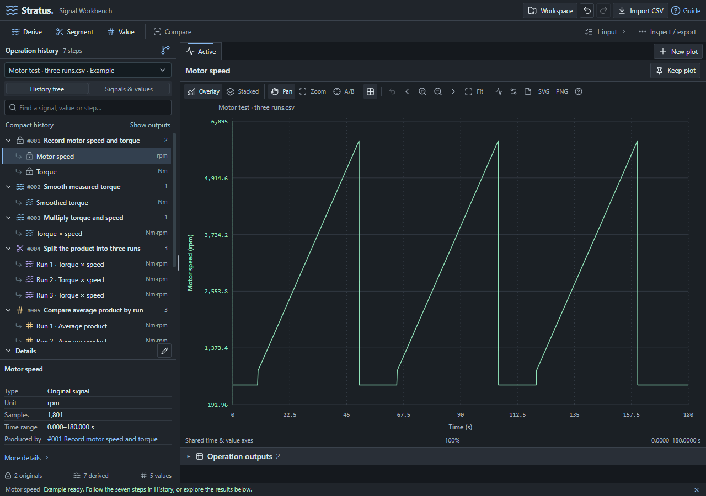
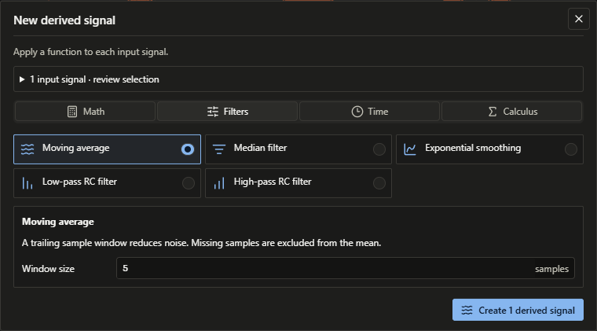
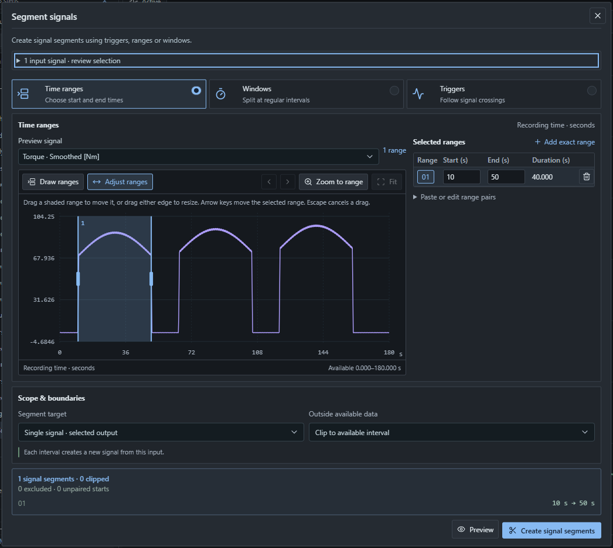
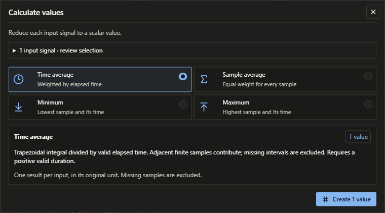
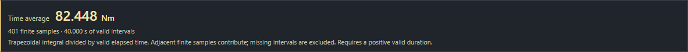
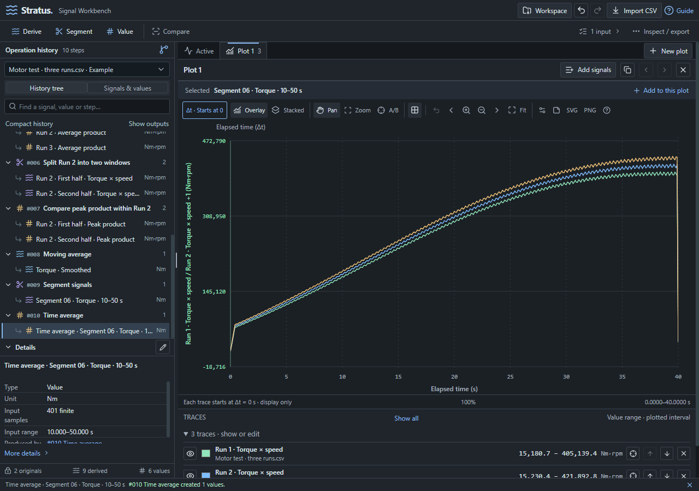
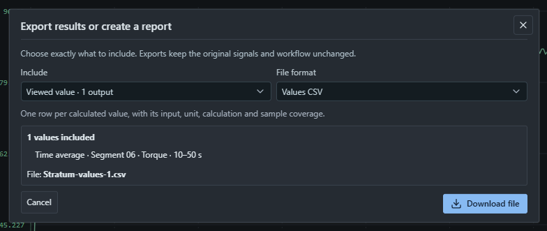
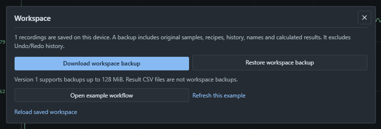

# Stratum: illustrated beginner's guide

## 1. Get to know the workspace

Stratum turns test recordings into traceable results. Import a recording,
process it, and measure values; every step keeps its inputs, so each result
leads back to the original recording. Original samples never change; each step
creates new signals or values.

### Start with the example recording

Launch Stratum. The welcome screen offers three ways to start: **Explore the
example recording**, **Import a recording** and **Test many recordings**. Choose
**Explore the example recording**. The motor-test example loads seven completed
steps, from original signals to smoothing, segments and values.

A short **example tour** opens above the plot. Choose **Next** and **Back** to
select each step with one sentence about its idea; the tour ends on a value.
It only selects existing items and never changes your work. Close it with
**×**; the **?** button in the top bar opens the guide, whose **Getting
started** tab offers **Start the example tour** again.



_Figure 1. History is on the left and the operations run along the top bar.
Active plots the selection above the step's outputs, and Details on the right
shows its properties and lineage._

Click the arrow beside a step in **History** to expand its outputs, then click a
signal name. Type in **Filter steps and outputs**, or choose the **All**,
**Signals** or **Values** chip, to find a result; **Ctrl+K** searches every step
and output. The recording menu at the left of the top bar switches between
recordings.

### Import your own data

Choose **Import a recording** on the welcome screen or **Import** in the top
bar, or drop files on the window. For CSV, use time in seconds in the first
column and units in square brackets in the header:

```csv
Time [s],Speed [rpm],Torque [Nm]
0.00,1500,210
0.01,1502,211
0.02,1504,212
```

Times must increase strictly, with no duplicates. Leave missing signal cells
empty. Semicolon-separated files with decimal commas, tab-separated .tsv/.txt
(including Excel's Unicode text) and Windows-1252 text also import. The import
step is named after the file, such as **Import SN-24001.csv**. If a file cannot
be imported, the message names the file, the row and the cause: for example a
date or clock time instead of seconds, or text in a number column. A header
without a unit still imports, with a reminder to add one. Work is saved locally
on this device.

Measurement files import directly too: **MDF 4 and 3** (.mf4, .mdf, .dat),
**NI TDMS**, **MATLAB .mat** (v4 to v7), **WAV** and **Excel .xlsx**. Their
channel names and units come from the file. When a file holds several groups
with their own time axes, such as an MDF file with a fast DAQ group and a slow
CAN group, a dialog lists them: each group you choose becomes a recording,
named like **Run 7.mf4 · Fast DAQ**, and the whole import is one Undo step. See
[file-formats.md](file-formats.md) for what each reader supports.

After the first import, a **Next: Derive · Segment · Value** strip above the
plot opens each operation. The screenshots in this guide use the example
recording, so you can follow along without importing a file.

<!-- pagebreak -->

## 2. Choose inputs and smooth a signal

The next three pages walk through one small workflow: smooth torque, keep a
10-50 second interval, then calculate its average.

### Select the original torque signal

Expand **#001 Record motor speed and torque** and click **Torque**. It appears
in **Active**. Check **Apply to** beside the operations in the top bar: it
should name **Torque** for this exercise.

**Remember:** viewing an item and checking processing inputs are separate
actions. Checked inputs stay selected while you browse. Choose **Clear checked
inputs** (the **×** beside **Apply to**) to use the item you are viewing again.

### Apply a moving average

Choose **Derive > Filters > Moving average**. Set **Window size** to **5**
samples, as shown below. The **Preview** beside the settings draws the input
and the smoothed result before anything is created: drag the slider or choose
a preset to compare settings, and drag across the preview to zoom. Check the
input named under the dialog title, then choose **Create 1 derived signal**.



_Figure 2. The Filters tab contains Moving average. Window size controls how
many samples are used; the button creates a new derived signal._

The new step appears at the end of History and its output is selected.
The original Torque signal remains available under step #001.

### Process several signals together

Select a step: Active plots its outputs together, and the **Outputs** tab below
the plot lists them. Tick the signals you want to process in its **Input**
column, then check **Apply to** before opening Derive, Segment or Value. Clear the checked inputs when you
want to return to a single selected signal.

You can also check signals directly in History. Click one signal, then
**Ctrl+click** others to add them, or **Shift+click** to check every signal in
between. Choose **Value…** in the bar below History to calculate one value for
each checked signal.

<!-- pagebreak -->

## 3. Find a useful time interval

A segment is a time interval of the whole recording, such as one test run. It
is not a signal: later steps choose to work **Within** it, and every signal of
the recording can be measured there.

Choose **Segment > Time ranges**. Click **Add exact range** and set
**Start (s)** to **10** and **End (s)** to **50**. The segment preview below
updates automatically.



_Figure 3. The shaded band and exact fields describe the same interval. The
preview confirms one segment from 10 s to 50 s, with no clipped intervals._

Check the preview boundaries, then choose **Create segments**. Select the new
segment in History: the plot shades it over the recording and zooms to it.
**Within** in the same dialog finds segments inside earlier ones, such as
10-second windows within each run.

You can also drag across the plot with **Draw ranges**, or move and resize a
range with **Adjust ranges**. **Windows** splits at regular intervals: drag the
highlighted range or its edges. **Triggers** uses signal threshold crossings:
drag a threshold line up or down and choose **Rising above** or **Falling
below**. Both plots shade the segments your settings will create. Start with
Time ranges while learning the workflow.

<!-- pagebreak -->

## 4. Turn a signal into a value

Check the box beside the smoothed signal in History, select the segment you
just created, then choose **Value > Time average**. **Within** already names
your segment and **Applies to** the smoothed signal; choose **Create 1 value**.
Each calculation card already shows its result, and the preview draws the
selected value over the signal in that segment. With **Within** set to all
segments of a step, Value gives one result per segment.



_Figure 4. Value creates one number per input signal. The calculation cards
explain how each result is calculated._

The new value opens automatically. The result card shows its value, unit,
finite sample count and valid time coverage; the plot below draws the value as
a labelled dashed line over its input signal.



_Figure 5. The result card and its reference line from this example exercise.
Your own recordings will produce different values and coverage._

**Time average** weights by elapsed time and excludes missing intervals.
**Sample average** gives each finite sample equal weight. **Minimum** and
**Maximum** find the lowest and highest finite samples. The **Spread**, **Time**
and **Events** tabs add RMS, standard deviation, peak to peak, area, durations,
time above or below a threshold and threshold crossings. Times are measured
in seconds from the input's start.

### Trace and revise your work

**Details** on the right shows the selection's properties, its lineage back
to the original recordings and the later steps that use it. The **⋯** menu in
the top bar also offers **View samples**, **Inputs and original signals**,
**Show lineage in History** and **Used by later steps**. Clear the filter if
History hides something you expect to see.

Use the buttons in Details, or right-click a History item, to rename it or
manage its step. **Edit settings** updates the step and recalculates
dependent results; **New version…** keeps the step and adds another with new
settings. **Delete** previews the dependent work it will also remove. **Undo**
and **Redo** in the top bar (**Ctrl+Z**, **Ctrl+Y**) keep the last 20
workspace changes, including across restarts.

<!-- pagebreak -->

## 5. Compare signals on a plot

**Active** follows the item you inspect. **Keep plot** creates a named plot
that stays open while you browse, and **New plot** starts a blank comparison.

### Compare the three example runs

Choose **New plot > Add signals**. Find the three **Run 1**, **Run 2** and
**Run 3** signals named **Torque × speed**, tick them, then choose
**Apply signals**. Turn on **Align starts** to compare their elapsed time.



_Figure 6. Three runs share an elapsed-time axis. Align starts is active; the
numbered badge on the plot tab shows that it contains three traces._

Selecting the step that created the runs plots them together on **Active**
too. **Align starts** changes the display only. **Compare** opens
**Compare & align** when you want to create reusable aligned signals, including
signals from different recordings.

### Navigate and adjust the comparison

- Click the plot to focus it, then scroll to zoom time. Shift-drag pans in time.
  Choose **Fit** to see the complete plot again.
- **Overlay** draws traces on one time axis, giving different units their own
  lanes; **Stacked** gives each trace a panel; **Y axes** overlays different
  units on independent scales. Open the trace list below a plot to show, hide
  or edit individual traces.
- Drag signals onto a plot to add them; **Add signals** lets you choose
  individual members. Selecting a segment shades it over its recording.
- Use the plot toolbar's **Export** menu to save an SVG or PNG image of the plot.

Named plot layouts are saved on this device, separately from workflow history
and workspace backups.

<!-- pagebreak -->

## 6. Export results and keep a backup

### Choose the results to export

Choose **Export data…** in the top bar or below a step's outputs. Choose
whether to include the viewed output, the checked signals, or all outputs from
a step, then a file format, review the included outputs and choose **Download
file**.



_Figure 7. This export contains just the viewed value. Check what is included
before downloading so you get the intended output or batch._

| Format             | Use it for                                                                                        |
| ------------------ | ------------------------------------------------------------------------------------------------- |
| Samples CSV        | Every evaluated sample, with its time axis; missing values stay blank.                            |
| Values CSV         | One row per calculated value, with units and its input.                                           |
| Signal summary CSV | A compact summary of each signal, without individual samples.                                     |
| Quick HTML summary | A snapshot of results, plots and contributing history. Open in a browser to print or save as PDF. |

For a laid-out document, choose **Add to report** on a plot, value or step and
compose the pages in **Reports**. Report captures are snapshots: they keep the
data as it was when you added it.

### Save the whole workspace

Choose the **Workspace** button (folder icon) in the top bar, then **Download
workspace backup**, and keep the **.stratum**
file somewhere safe. Older **.stratus** backups can still be restored.



_Figure 8. Workspace backups preserve the analysis for later restoration.
Result CSV files are not workspace backups._

A backup includes original samples, recipes, results, names and history; saved
plot layouts and Undo/Redo history are excluded. **Restore workspace backup**
replaces the current workspace after confirmation; Undo can recover the prior one.

Desktop and browser workspaces have separate local storage. Use a backup to move
your analysis between them or to another computer. The desktop app saves
backups and Samples CSV through a Save dialog with no size limit, and
**Automatic backups** in the Workspace dialog keeps the newest 10 backups in a
folder you choose. In the browser, backups support up to **128 MiB** and Samples
CSV **64 MiB** per file; for a larger sample export, choose fewer signals or
shorter segments. The **?** button in the top bar opens
the guide, with **Getting started**, **Concepts**, **Shortcuts** and **Batch**
tabs. The sun or moon button switches between light and dark themes.

## 7. Test many recordings

Choose **Test many recordings** on the welcome screen, or the batch example in
the **Import** menu, to run a saved workflow on eight motor recordings. To
build your own, finish the steps on one recording, save that recording's
workflow from the **Import** menu as a `.stratum.yaml` file, then run it on
other recordings. Each recording becomes one item with its own steps, checks
and status. See `docs/batch-workflows.md` for details.
