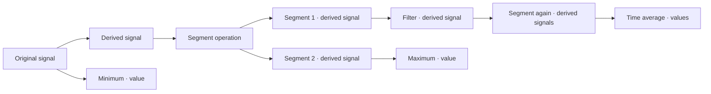

# Signal workflow and history

Implemented on `codex/workflow-history`, starting from `e6264a5` on `main`.

## The working model

An original signal is immutable. A derived signal has its own identity, recipe,
and exact input IDs. Either type can feed another derivation, segmentation, or
value calculation. A segment is a derived signal containing a time interval of
its input. It can be segmented again, at any depth. A value is a scalar result,
with its unit, calculation, and input identity; it is an endpoint, not a signal.



## History is the primary navigation

The center is a plot scratchpad. **Active** follows the inspected signal (or a
value's input); **Keep plot** copies that signal into a named comparison tab.
**New plot** starts an empty tab. Named tabs stay selected while browsing History,
and **Add to this plot** adds the inspected signal without changing checked
processing inputs. The searchable **Add signals** dialog can also use checked
inputs. Step outputs remain a separate tab with the existing export scopes.

Dragging a segment onto a plot adds the exact outputs of its producing segment
operation. Dragging it onto a processing tool selects only that member. Operation
rows drag their complete output membership. Scalar values plot as dashed reference
lines; signal-processing tools explicitly use their input signals instead.
**Create plot** in a History item's context menu opens a new plot with the same
output membership as dragging that item onto **New plot**, including whole
operation batches and segment families. It keeps the inspected item, checked
processing inputs, search and focused output tree unchanged.
Toolbar drops select their subject and replace processing scope before opening an
editor. Cancelled drags preserve selection; incompatible targets stay inactive.

Each tab holds up to 10,000 traces; the scratchpad holds up to twelve named tabs.
Oversized drops are rejected whole. Trace controls are paged in groups of 30 and
stacked plots in groups of eight. Overlays combine independent SVG subpaths by
style to retain the complete batch without a DOM element for each signal.
Trace visibility, colors, names, layout, elapsed-time and grid settings persist in device-local
browser storage, separately from workflow Undo/Redo and workspace backups. These
are live references to signal IDs, not sample snapshots. Editing an operation
refreshes its plots. Removed signals remain marked unavailable so Undo can restore
them. Closing a tab offers Reopen for the most recently closed plot.

The optional Δt display subtracts each trace's own interval start. It changes no
samples, time references or workflow history. It permits elapsed-time comparisons
across recordings. Otherwise overlays require matching units and explicit time references. Other comparisons
use stacked axes, with independent time axes clearly labeled when clocks differ.
Zoom, pan, and Fit adjust the bounded plot preview; summaries describe all samples.
Exact samples and exports still come from evaluated engine data, never the preview.
The toolbar above History has labelled Derive, Segment and Value actions, with
Compare, an input-count control and an inspection/export menu underneath. Edit,
duplicate, rename and delete live in each History item's context menu. Inspection
preserves checked scope; an explicitly empty scope disables creation. The input
review offers Follow selection to return to automatic inputs. The footer shows
selection, processing scope, totals and progress; signal details no longer occupy
space below the plot.
Only the selected tab renders charts, and signal choices are paged in groups of 30.

Drag the divider beside **Operation history** or **Properties** to resize either
sidebar. Widths are remembered on this device and constrained to leave room for
the plot. Focus a divider and use Left/Right arrows (Shift for larger steps),
Home/End for its limits, or Enter to reset. Double-click also resets the width;
Escape cancels an in-progress drag. Narrow windows retain the stacked layout.

The history tree has two levels: an operation and its immediate outputs. The
operation sequence remains chronological, oldest first. Dependency depth does
not increase indentation. Stable step references identify where a signal was
created, including when several outputs have the same channel name.

For example:

```text
#001 Import recording
     Engine speed                         Original signal
     Torque                               Original signal
#002 Moving average                       From #001 Torque
     Torque · Smoothed                    Derived signal
#003 Segment signals                      From #002 Torque · Smoothed
     Segment 01 · 12–51 s                  Derived signal
     Segment 02 · 70–109 s                 Derived signal
#004 Segment signals                      From #003 Segment 01
     Segment 03 · 15–20 s                  Derived signal
#005 Time average                         From #004 Segment 03
     Torque · Time average                Value
```

Branches are expressed by input links, not by moving later operations underneath
earlier ones. This keeps chronological order honest when a user returns to an
earlier signal and starts a new branch. A binary operation has links to both
inputs. Trigger-defined segments also expose the signals used for boundaries.

The tree previews three outputs per operation, plus the selected output when it
is elsewhere in a large batch. **View all outputs** focuses the history sidebar
on that operation and its complete output tree without changing the active view
or processing inputs. Search and lineage filters still apply. **Back to history**
(or Escape in the tree) restores the previous history scroll position, keyboard
focus and collapsed rows. Only the visible history rows are mounted, including
in the focused output tree.
The **Signals & values** index provides a flat, searchable list of every output.
**Compact history** collapses other output lists while keeping the selected
output visible; **Show outputs** restores the previews across all steps.

Selecting an output shows:

- its type, units, interval, and producing step;
- clickable **From** links to immediate inputs;
- the full contributing lineage, in creation order, including all input branches;
- a **Show lineage in tree** filter with an explicit return to all steps;
- links to later operations that consume the selected signal;
- the plot or scalar result, with the original signal still accessible.

Arrow Up/Down moves focus in the tree. Arrow Right/Left expands or collapses an
operation; Home/End jumps to the first/last visible row; Enter or Space selects.
Right-click an operation or output (or press Shift+F10) for its edit, duplicate,
rename and deletion actions. Actions target that item, including when another
item is selected. Double-click opens the producing operation's saved settings;
originals and saved region scopes open Rename instead. F2 also opens Rename.
Disclosure arrows only expand or collapse outputs. Deletion keeps the existing
dependent-operation confirmation, and checked processing inputs stay separate.
The Back button returns to the previous selection without changing the workflow.

## Creating the next step

Select a signal to use it as the next input, or use checkboxes in an output table
to choose an exact batch. Once inputs are explicitly checked, inspecting another
signal, value, operation or parent does not replace them. The action bar states
whether inputs follow the signal in view or are an explicit checked collection.
**Use only this signal** returns to the single viewed signal. Viewing an operation
does not silently select all its outputs. **Select all signals** is explicit,
and honors the output search. New batch outputs are selected together
so the next operation can continue across that batch.

The three actions are **Derive signal**, **Segment**, and **Calculate value**.
Their dialogs show the exact input list. Segmentation defaults to the selected
signals, with manual ranges in recording time and an interval preview. Trigger
crossings and fixed-duration windows remain available. Time-shifted and zeroed
signals retain their own displayed axis; segmentation ranges use recording time
and are translated into the target recipe. Each selected batch member is scanned
independently, clipped to its own available interval.

**Repeat with new settings** appends another operation. It never changes the old
recipe, output IDs, downstream signals, or stored scalar values.

## Values and numerical meaning

Minimum and maximum use finite samples and record the first occurrence time.
Sample average assigns equal weight to finite samples. Time average divides the
trapezoidal integral by valid elapsed time, using only intervals between adjacent
finite samples. It does not bridge missing samples. A single isolated sample has
no time average. Missing or non-finite results are stored explicitly as
unavailable, not zero. Every scalar stores its finite sample count and valid
duration. Values can be exported with input and operation IDs.

Existing `min-max` recipes retain their extrema samples as derived signals for
compatibility. New minimum/maximum calculations create true scalar values.

## Existing work and rollback

Opening an old workspace adds history metadata without changing signal samples,
node IDs, recipes, region versions, or calculations. Explicit old batch IDs define
grouping; names never determine membership. Previously hidden region-scoped crop
inputs become visible derived outputs. Standalone region settings remain as
**Saved region ranges**, with an action to create signal segments from their exact
boundaries. They are not silently expanded into copies of every channel.

For older work that did not store a global invocation order, migration uses the
available timestamps and dependency order. All newly recorded steps have an
append-only sequence, including after a clock change. Step/output metadata is
saved in the same IndexedDB transaction as the operation. Failed or cancelled
batches publish no partial values; the existing concurrent-writer check applies.

`main` remains the earlier implementation. The new IndexedDB fields are additive;
returning to the old branch does not delete originals. The older UI does not
display the new scalar records. Use the workflow branch to see them again. Close
the app before switching and rebuilding a branch. User data stays local; no
desktop workspace is uploaded or replaced by validation.

## Verification and limits

### Inspection and delivery

Individual outputs open **Plot & samples** or **Value & input**. Operation rows
open **Step outputs** directly; **View all outputs** opens the operation's full
tree in the history sidebar with a return button. The compact action bar
keeps checked input scope visible; long input lists and full lineage expand only
when needed. Narrow layouts keep history behind a labeled toggle. Native charts
adapt tick density to their width without distorting axis text. A named lineage
filter shows only contributing outputs, excluding unrelated siblings.

**Export / report** is available alongside the inspection tabs. Its dialog names
the exact scope, output count, format and filename before downloading. Viewing
one result defaults to exporting that result; whole-step export is explicit.
Table filters never silently change export scope.

- Samples CSV contains actual evaluated times and values, including nested
  segments and shifted clocks. Missing values are blank. Multiple signals use
  separate rows to preserve their individual sampling grids.
- Signal summary CSV contains one row per signal, not individual samples.
- Values CSV contains the exact selected scalar results and input references.
- Printable HTML reports are self-contained snapshots with results, bounded
  signal plots and chronological contributing history. They can be opened
  without the app and printed or saved as PDF using a browser. Imported labels
  are escaped; formula-like CSV text remains text in spreadsheet software.

Reports do not yet provide an editable layout, saved report templates or combined
multi-axis plot design. Large sample files are assembled in memory as a Blob and
remain subject to device memory limits. Export cancellation suppresses download
even when the worker request had been queued.

`pnpm test` includes numerical, storage, migration, chronological ordering, batch
membership, and 5,000-level history checks. `pnpm desktop:ui-smoke` tests the real
native renderer with isolated temporary storage: derivation, nested segmentation,
values, a 40-output batch, pagination, input recovery, and keyboard navigation.
It verifies actual native downloads for one-value and whole-batch scopes,
evaluated nested samples and standalone reports. Unit tests check missing data,
shifted sample axes, export escaping and contributing-only history.
It writes an ignored native screenshot to `outputs/workflow-desktop.png`.

The history is virtualized and output tables are paged. Existing data-engine
limits remain: 1,000 segments or 10,000 output signals per segmentation batch,
browser storage quotas, and a scan to generate a signal's first plot. This change
does not add workflow scheduling, mutable recipes, plugins, or binary importers.
