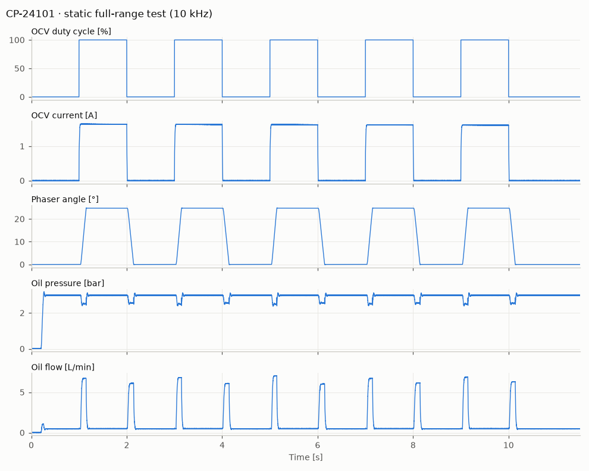
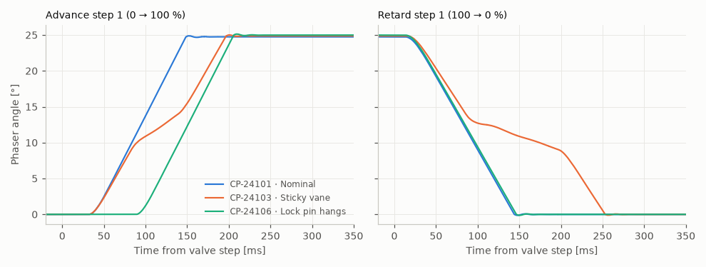

# Cam phaser static end-of-line example

Synthetic recordings from an imaginary end-of-line rig for vane-type cam
phasers, one CSV per phaser, plus a workflow that processes, checks and
reports each one. They come from a small physical model, not from real
equipment.

## The test

The phaser is clamped on a static fixture: the camshaft does not turn, so
the only loads are friction, the bias spring and the oil. The rig supplies
engine oil at a regulated 3.0 bar and 70 °C and drives the oil control valve
(OCV) with a 13.5 V PWM signal.

| Time      | Step                                                                 |
| --------- | -------------------------------------------------------------------- |
| 0–0.2 s   | No oil pressure; the phaser is held at its base stop by the lock pin |
| 0.2 s     | The supply valve opens; pressure settles at 3 bar                    |
| 1 s       | First step to 100 % duty: the phaser travels to its advance stop     |
| every 1 s | The duty alternates 0 → 100 → 0 %, five full cycles                  |
| 10–11.5 s | Held at the base stop until the rig stops logging                    |

Every recording is 11.5 s at 10 kHz (115,001 rows, about 4 MB):

| Column          | Unit  | Notes                                                                                      |
| --------------- | ----- | ------------------------------------------------------------------------------------------ |
| Time            | s     |                                                                                            |
| OCV duty cycle  | %     | The rig's command: 0 or 100                                                                |
| OCV current     | A     | Coil current; the knee on each edge is the armature moving. Falls slowly as the coil warms |
| Phaser angle    | °     | Cam degrees from the locked base position, advance positive, 16-bit encoder                |
| Oil pressure    | bar   | At the phaser supply port: dips while the phaser moves, spikes when it hits a stop         |
| Oil flow        | L/min | Supply flow: leakage at rest, about 6.5 L/min while moving                                 |
| Oil temperature | °C    | Supply oil, 0.1 °C resolution                                                              |

A good phaser starts moving about 40 ms after the valve step (current rise,
spool travel and, when advancing, lock-pin release), reaches 90 % of its
stroke in about 140 ms, and travels about 24.8°. At rest it leaks about
0.5 L/min.

## The units

| File         | Expected | What is different                                                                              |
| ------------ | -------- | ---------------------------------------------------------------------------------------------- |
| CP-24101.csv | Pass     | Typical phaser                                                                                 |
| CP-24102.csv | Pass     | Typical phaser                                                                                 |
| CP-24103.csv | Fail     | A burr on a vane drags through 9–14°; the retard step, against the spring, takes about 0.24 s  |
| CP-24104.csv | Fail     | Debris at the advance stop limits the authority to about 21.6°                                 |
| CP-24105.csv | Fail     | Worn vane-tip seals: about 1.5–1.7 L/min leakage at the stops, above 1 L/min                   |
| CP-24106.csv | Warning  | The lock pin hangs on its first release: the first advance starts after about 96 ms, not 40 ms |
| CP-24107.csv | Warning  | The rig regulator drifted to about 2.5 bar, so the test conditions are invalid; retest         |

[Cam phaser static EOL test.stratum.yaml](Cam%20phaser%20static%20EOL%20test.stratum.yaml)
finds the advance steps with duty-cycle triggers, the retard steps from the
duty step until shortly after the phaser is back at its base stop, and within
each step a 0.4 s settled window starting 0.5 s after the valve step. It then
measures, for every step:

- **authority**: the average angle at the advance stop (23.5–26°);
- **base angle** at the base stop (±0.3°, warning);
- **advance dead time**: time to 0.5° (at most 80 ms, warning);
- **response**: time to 90 % of stroke advancing and to 10 % retarding, using
  the unit's own measured authority (at most 0.22 s);
- **leakage**: average flow at each stop (at most 1 L/min);
- **peak flow** while advancing;
- **OCV current** at 100 % (1.45–1.85 A);
- **test conditions**: supply pressure (2.8–3.2 bar) and oil temperature
  (67–73 °C), as warnings that ask for a retest.

Its report template has a title with the serial number, a status summary, a
plot of duty, angle, pressure and flow, and on a second page tables of the
key results and of any flagged checks.

## Try it

In Stratum, choose **Import ▾ → Open a workflow file…**, pick the
`.stratum.yaml` file, then add the CSV files. You can also drop the workflow
file and the CSVs onto the window together.

## Regenerate

The files are generated by `lib/cam-phaser-example.ts`. After changing it,
run `pnpm examples:phaser`. `pnpm test` fails if the committed files no
longer match the generator. The preview images are not generated by the
repository; redraw them if the data changes.
